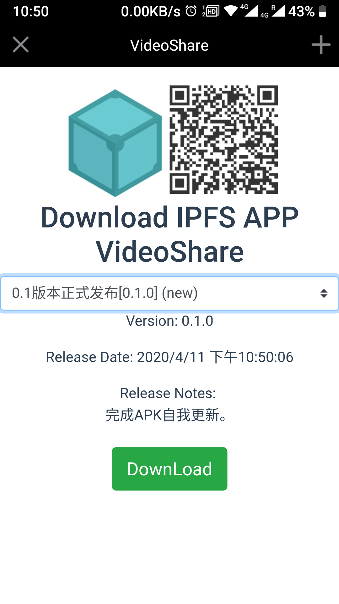

# ipfs_apk
ipfs apk 管理器

## 食用方法
git地址：https://github.com/bill080307/ipfs_apk.git
在ubuntu18上运行
~~~
git clone https://github.com/bill080307/ipfs_apk.git
cd ipfs_apk/api
# 根据自己的情况填写配置
vim config.json
# 安装
./install.sh
~~~
## 效果

## 目录结构
~~~
ipfs_apk/
├── admin        # 后台管理界面的前端VUE项目
├── api
│   ├── admin-api.py     # 后台API主程序
│   ├── config.json     # 后台API服务配置
│   ├── install.sh     # 安装脚本
│   ├── ipfsapk.conf     # 后台网页显示 Nginx配置
│   ├── ipfsapk.service     #  后台API服务配置文件
│   └── requirements.txt     # 后台API程序依赖库
├── LICENSE
├── README.md
└── webui           # 前台下载界面的前端VUE项目

15 directories, 36 files
~~~

config.json
~~~
{
  "projectName": "VideoShare",  # 项目名称
  "service": {   # 后台服务绑定端口和参数
    "host": "127.0.0.1",
    "port": 5050,
    "workers": 1
  },
  "ipfsApi": "/ip4/172.16.7.1/tcp/5001",  # ipfs-api
  "ipfsGW": "http://172.16.0.60:8082/ipfs/:hash",  # ipfs-gateway
  "localStorage": "/data/",  # 本地储存路径，用于共享储存，Filestore
  "StorageSubPath": "apk", # 本地储存子路径
  "redisCacheServer": [ # redis服务缓存地址，使用多个，必须配置一个，有效数据已第一个为尊，配合ipns缓冲器使用：https://blog.csdn.net/weixin_43668031/article/details/100174147
    {"host": "172.16.0.60", "port": 6379}
  ],
  "uiTemplate": "QmQBQP2V8qo3VGXs8pZA685wB3gkbcmcdcEv2UwcUAJPWq" # 前端模板地址，即webui编译后的前端上传至ipfs的结果,运行`./install.sh ui`自动替换
}
~~~

## 安装说明
install.sh
子命令
`./install.sh ui`
编译下载界面，上传到ipfs空间上，自动将前端的hash替换到config.json模板中

`./install.sh admin`
编译后台界面，放置到nginx目录

`./install.sh api`
注册ipfsapk服务，根据config.json服务ip和端口启动api服务，默认为127.0.0.1:5050，反向代理至nginx里，默认为为后台前端的/api/路径。
注册的服务名为ipfsapk
可以通过`systemctl status ipfsapk.service`查看服务状态
可以通过`systemctl start ipfsapk.service`开启服务状态
可以通过`systemctl stop ipfsapk.service`关闭服务状态

`./install.sh`
以上项目全部运行
